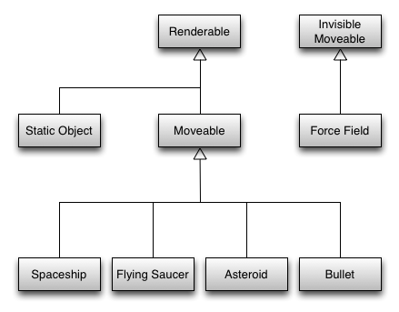
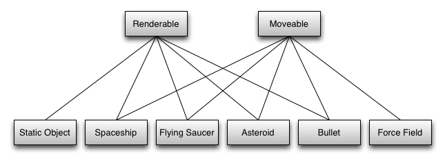

## A-Frame 简单总结

### 简介

A-Frame 是基于 three.js 的高级封装，是 Mozilla 的 MozVR 团队在 2015 年发布的开源框架。
主要针对不熟悉 WebGL 技术的大量 Web 前端开发者，使用他们所熟悉的 HTML 代码在网页上开发 VR （虚拟现实）应用。

A-Frame 很大的一个优点是提供了对 VR 头戴设备和非 VR 设备（例如电脑以及智能手机）之间的无缝响应。
也就是说在 PC 和 移动端 网页上也可以有不错的体验。

### 相关链接

[官方文档](https://aframe.io/docs/0.2.0/guide/)：非常全面详细的讲解了各种概念和 API

### ECS 模式

A-Frame 的设计思路是基于的 **[entity-component-system](https://aframe.io/docs/0.2.0/core/)** （ECS）模式，
它常用于游戏开发当中。翻译过来应该叫做：基于组件的实体系统。它侧重于可组合性，而非可继承性。
因此 A-Frame 项目的开发过程就是实现和使用不同的 实体（entity）和 组件（component）的过程。

我们先来参考一下游戏开发中的实体系统模式：

#### 游戏开发中的 ECS

在面向对象的游戏编程中，由于对象之间的继承关系会比较复杂，常常面临需要多重继承之类的问题，
在复杂的游戏中类的关系会迅速变的不可控，因此原则上要遵循 **偏好使用合成超过继承(favour composition over inheritance)**。

继承的结构


合成的结构


通过这种合成生成的对象：静态对象、太空船、飞碟、小行星、子弹和force field都叫做 **实体(entities)**。

每个实体内部都实现了 render 方法、move 方法，便于外部的进程管理器在游戏循环中统一调用所有实体的这两个方法，
以实现实体的渲染和移动。

但这又引入了一个新的问题：如何共享实体中合成的各个对象之间的数据，
如上图中的 Renderable 需要 position 和 rotation 值，而 Moveable 修改了 position 和 rotation 值。

于是又引入了新的概念（类），我们称其为： **组件（component）**。
这些组件就是一些值对象，因为对象是引用传递的，因此可以实例化一个 position 组件对象，然后同时传给 Renderable 和 Moveable 对象，
来达到共享数据的目的。

更进一步，我们可以直接抛弃 Renderable 和 Moveable 类，实体类中的 render、move 方法由对应的 **子进程管理器** 实现，
而它们内部的组件对象直接放到实体类中，比如：position 组件、rotation 组件。

这些 子进程管理器 拥有 add、update、remove 方法，且包含一个实体列表。
3 个方法分别用来：添加新的实体、更新实体（遍历所有实体并实现原来的 render、move 方法）、移除实体。
比如原来的 Renderable 类，会对应一个 RenderProcess 进程管理器，它的 update 方法会遍历所有的实体，
并根据每个实体的组件的不同的值，在 canvas 上绘制出不同的结果。

这些进程管理器我们也称其为系统，因此有 RenderSystem、MoveSystem。

最终，包含了多个组件（数据）的实体，在实例化后被添加到不同的系统中，并在游戏循环中被渲染和更新。

这样一来，实体其实很简单，只是一个组件的容器。

补充一下，在系统中被用到的组件集合，我们称其为节点。比如 MoveSystem 中，需要用到 position、velocity、rotation 3 个组件，
我们会将它们 3 个组件组合成为一个节点类。

实体系统框架的核心类是系统管理器（上文之前叫进程管理器），它的任务就是管理各个系统。

实体只关心组件，系统只关心节点，而实体会根据需要被添加到不同的系统。
为了管理这个过程，又引入了 Engine 类。可以在 Engine 类上对实体和系统进行添加、删除操作。
Engine 类跟踪实体上的组件并创建(和在必要时销毁)节点,将这些节点添加到节点集合中。Engine 类也为系统提供了方法来得到其需要的集合.

;

更详细的内容，请参考： [游戏开发中的实体系统框架（译文）](http://blog.csdn.net/aisajiajiao/article/details/19011259)、
（[原文](http://www.richardlord.net/blog/what-is-an-entity-framework)）。
[游戏Entity设计不完全整理](http://blog.csdn.net/nightmare/article/details/1415188)。


#### A-Frame 中的 ECS

* entity 是一个通用对象，不具有渲染功能
* component 是一个嵌入到 entity 中的可重复实用的模块。提供给 entity 外观、行为、功能，具有即插即用的特点
* system 提供了全局的环境和服务，并管理各个种类的组件

通过 ECS，我们可以通过添加不同种类的可复用组件，构造出具有复杂行为的实体。
对比在传统的继承模式下，则需要创建一个新的类来扩展出新功能。

举个简单的例子，假设 car 是一个实体，那么它可以拥有如下组件：

* color 组件：决定 car 的颜色
* engine 组件：组件拥有 horsepower 属性 和 weight 属性，共同来决定 car 的速度
* tire 组件：拥有 friction 属性，决定 car 的摩擦力

这些组件会相互影响共同决定了 car 的行为。并且这些组件还可以应用在其他交通工具，如：飞机、火车 等上面（除了 tire）。

在具体应用当中：

* entity 实体，通过 HTML 元素 `<a-entity></a-entity>` 来表现
* component 组件，通过 HTML 元素的属性来表现
* component 组件的属性，通过属性的值来表现

如下表示了一个番茄红色的球体，拥有组件 geometry、material，组件的属性用内联样式语法表现：

```
<a-entity geometry="primitive: sphere; radius: 1.5"
          material="color: tomato; metalness: 0.7"></a-entity>
```

我们可以通过添加更多的组件来赋予球体各种外观、行为、功能，如 light 组件来让它发光，
sound 组件来让它发出声音，physics 组件来让它收到重力影响并检测碰撞。

```
<a-entity geometry="primitive: sphere; radius: 1.5"
          material="color: tomato; metalness: 0.7"
          light="type: point; color: tomato;"
          sound="src: #rickroll; volume: .9"
          physics="boundingRadius: 1.5; mass: 1;"></a-entity>
```

我们可以引入第三方开发的组件。只需要引入组件，然后直接应用到 HTML 元素上就可以了。另外也可以自定义一些自用的组件。
总之 ECS 模式非常的灵活和可扩展。

可以参考：[官方 Guide](https://aframe.io/docs/0.2.0/guide/)的两个例子：
[简单的物体](http://tianyn1990.github.io/AFrame/examples/html/helloword.html)、
[可交互效果](http://tianyn1990.github.io/AFrame/examples/html/helloword2.html)


### A-Frame 可以做什么


#### 记录

A-Frame is based on an [entity-component-system](https://aframe.io/docs/0.2.0/core/) pattern,
most logic should be implemented within components.
The development workflow within A-Frame should try to revolve around components.
The component documentation goes into much more detail on what a component looks like and how to write one.
A-Frame 是在 threeJS 之上的抽象。
使用 A-Frame 组件（跟 Web 组件无关），我们可以完成所有 threeJs 能做的事。

components 组件，除了原生框架提供的之外，还可以加载第三方，或者自己实现。

* 基于 entity、primitive、component
* 右手坐标系
* 单位：米
* 图形变换操作：position, rotation, scale 组件
* 纹理（texture）：除了默认的 flat color，还可以使用 src 设置 image 或 vidow 作为纹理。
* 资源管理系统：缓存、预加载资源，使用 <a-assets>
* 动画系统：将 <a-animation> 作为对应 entity 的子元素
* 灯光系统
